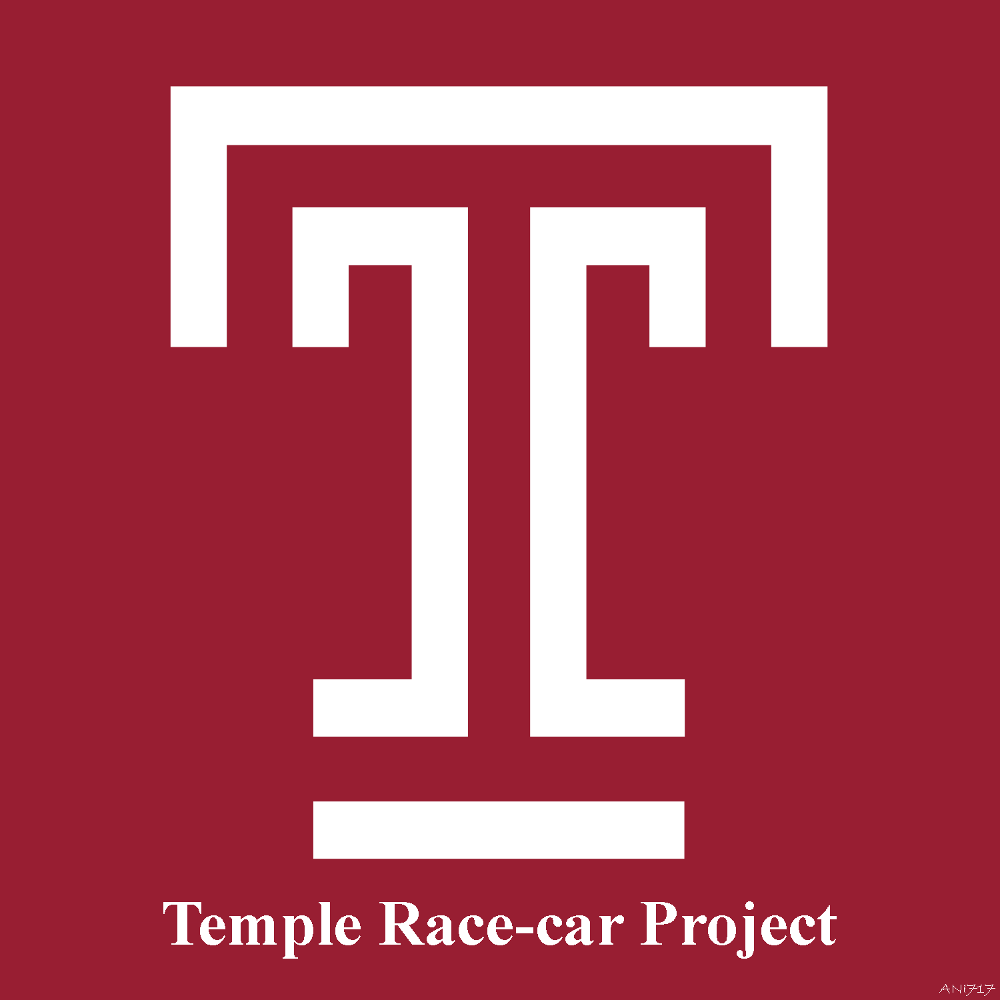

[![Contributors][contributors-shield]][contributors-url]
[![Forks][forks-shield]][forks-url]
[![Stargazers][stars-shield]][stars-url]
[![Issues][issues-shield]][issues-url]
[![MIT License][license-shield]][license-url]
[![LinkedIn][linkedin-shield]][linkedin-url]

<!-- PROJECT LOGO -->
<br />
<p align="center">
  <a href="https://github.com/ANI717/race-car">
    
  </a>

  <h1 align="center">Temple Race-car Project - Deep Learning Repository</h1>
</p>

We are developing an End-to-end Learning Architecture for Autonomous Driving with Regression Model Approach. The End-to-end Learning Architecture contains a stack of Convolutional Layers for Preprocessing and Feature Extraction from Images, followed by Fully Connected Layers on top. The whole architecture is defined as Convolutional Nueral Networks or ConvNets (CNN) in concurrent literatures.

## Colaborators
(https://sites.temple.edu/cflab/people/)
* Dr. Li Bai
* Animesh Bala Ani
* Michael Nghe

## Environment SetUp (Windows)
* Install Anaconda (64 Bit, Python 3.7 version or higher)
```
https://www.anaconda.com/products/individual
```
* Install OpenCV and Torch modules with Anaconda prompt.
```
pip install opencv-contrib-python
conda install pytorch -c pytorch
conda install torchvision -c pytorch
```

## Software Repository (Python, OpenCV, PyTorch)
### Driver Softwares
* av_create_dataset.py
```
Creates CSV files contaning list of image directory paths for training, development and testiong sessions.
```
* av_refine_dataset.py
```
Removes unwanted images with false annotation and refine dataset visually.
```
* av_train_test.py
```
Driver software to run training and testing sessions
```
* av_prediction_test.py
```
Driver software to test prediction visually
```

### Supportive Tools

* racecarNet.py
```
Contains the Deep Neural Network architecture 
```
* rc_nn_tools.py
```
Contains necessary tools to run training and testiong sessions
```
* rc_nn_utility.py
```
Contains utility tools for parsing and generating data in proper format to support deep learning sessions
```
* rc_data_handler.py
```
Contains required tools to prepare proper dataset for deep learning sessions
```
* rc_visualization.py
```
Contains tools to show performance visually
```

## Database
* data/images/
```
Contains raw images collected in different environments and time period. 
The image repository remains immutable during whole session.
```
* data/lists/
```
Contanis CSV files with lists of image directories for deep learning session. 
Contains randomly shuffled image set along with 5 fold cross validation set for training and testing session.
```
* models/
```
Contains .pth model files storing learned weights from deep learning sessions.
```

## Sample Prediction Test
### Temple Race-car Project - Prediction on Captured Video 1
[](http://www.youtube.com/watch?v=6__Wq2JxxDI "Temple Race-car Project - Prediction on Captured Video 1")

### Temple Race-car Project - Prediction on Captured Video 2
[](http://www.youtube.com/watch?v=yulaIIDh_K0 "Temple Race-car Project - Prediction on Captured Video 2")


<!-- MARKDOWN LINKS & IMAGES -->
<!-- https://www.markdownguide.org/basic-syntax/#reference-style-links -->
[contributors-shield]: https://img.shields.io/github/contributors/ANI717/race-car.svg?style=flat-square
[contributors-url]: https://github.com/ANI717/race-car/graphs/contributors
[forks-shield]: https://img.shields.io/github/forks/ANI717/race-car.svg?style=flat-square
[forks-url]: https://github.com/ANI717/race-car/network/members
[stars-shield]: https://img.shields.io/github/stars/ANI717/race-car.svg?style=flat-square
[stars-url]: https://github.com/ANI717/race-car/stargazers
[issues-shield]: https://img.shields.io/github/issues/ANI717/race-car.svg?style=flat-square
[issues-url]: https://github.com/ANI717/race-car/issues
[license-shield]: https://img.shields.io/github/license/ANI717/race-car.svg?style=flat-square
[license-url]: https://github.com/ANI717/race-car/blob/master/LICENSE.txt
[linkedin-shield]: https://img.shields.io/badge/-LinkedIn-black.svg?style=flat-square&logo=linkedin&colorB=555
[linkedin-url]: https://www.linkedin.com/in/ani717
[product-screenshot]: images/screenshot.png
